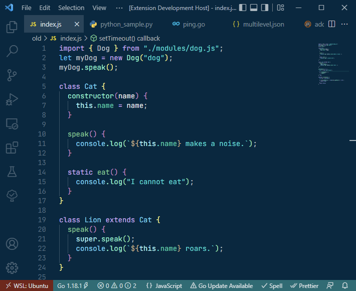

# [Night Coder](https://marketplace.visualstudio.com/items?itemName=a5hk.night-coder)

A dark theme for Night Coders. It has eight variants with different color palettes, text styles, and UI colors.

### Regular color palette

### Pastel color palette

## Other versions

- Vim: [/vim/colors/](/vim/colors/)

## Regular Color Palette

| Scope | Color | Hex |
|:------|:-----:|:----|
|Function call, Attribute name||#3df5b8|
|Function call, Attribute name||#3df5b8|
|Foreground, Variable||#c5ced4|
|Constant, HTML unrecognized tag||#12f1fd|
|Miscellaneous||#a8a8ff|
|Type||#4dc3fe|
|Parameter, Argument||#e5e9ec|
|Operator||#d1aaf8|
|Comparison/Logical operator||#b3f2ff|
|Comment||#456174|
|Documentation comment||#aab7c0|
|Function declaration, HTML link tag||#7ece98|
|Non variable constant, HTML custom tag||#a8a8ff|
|Namespace/Class/Struct, HTML style tag||#77d8f8|
|Namespace/Class/Struct, HTML style tag||#77d8f8|
|Tag punctuation||#788c9a|
|Script tag||#d9d326|
|String||#63e9e2|
|Property, Tag ||#2dd2ae|
|Keyword, HTML meta tag||#d1aaf8|

## Screenshots

### JavaScript

### JSON

### Python

## License

[MIT License](LICENSE)
